[Index](../index.md)

# 現存12城

# 弘前城（青森県弘前市）
津軽家十二代の歴史を物語る、総構えの壮大なる名城

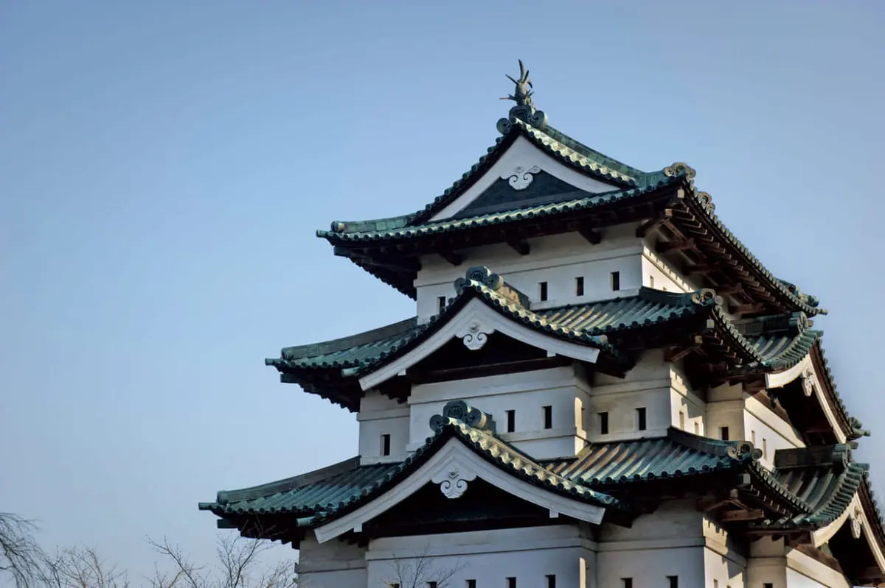

# 松本城（長野県松本市）
戦国の世の空気をまとい、実戦を見据えた造り

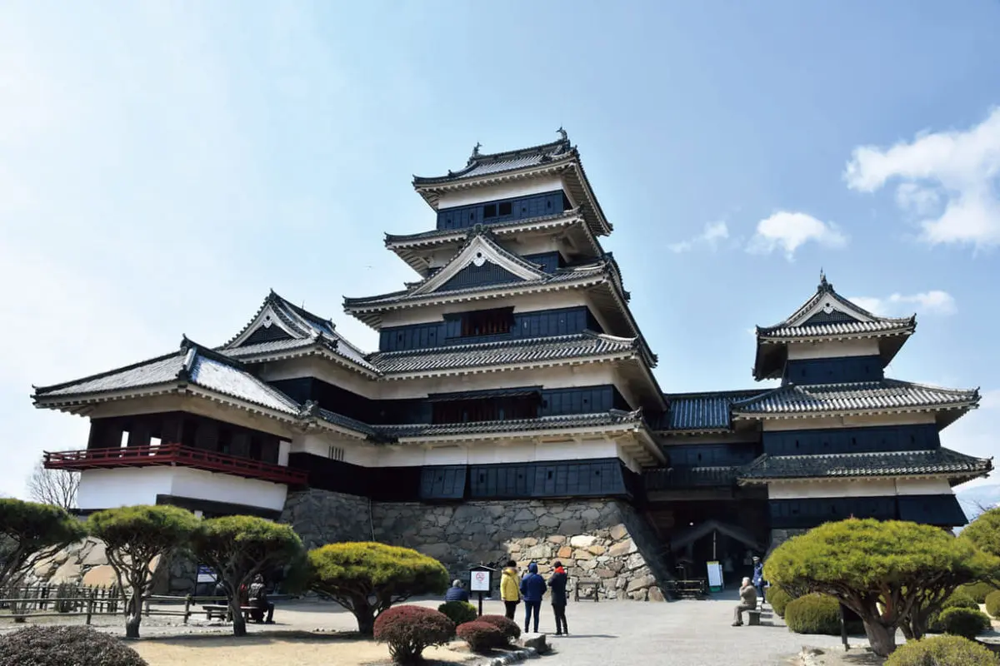

# 犬山城（愛知県犬山市）
木曽川のほとりで美濃をにらむ、国盗りの要諦となった名城

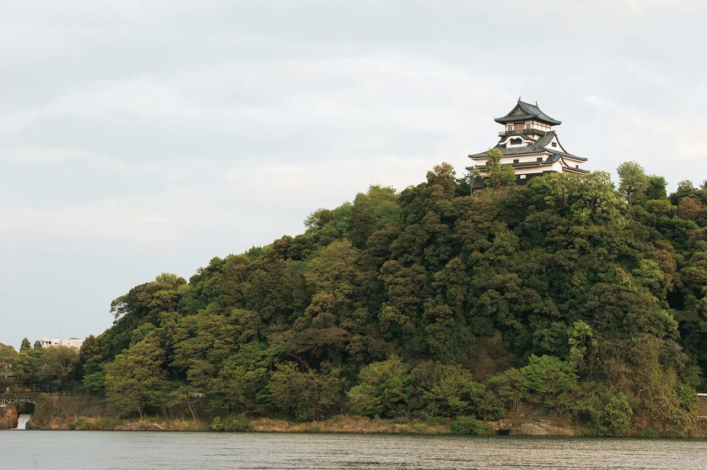

# 丸岡城（福井県坂井市）
日本最古級400年の歴史を刻む現存天守

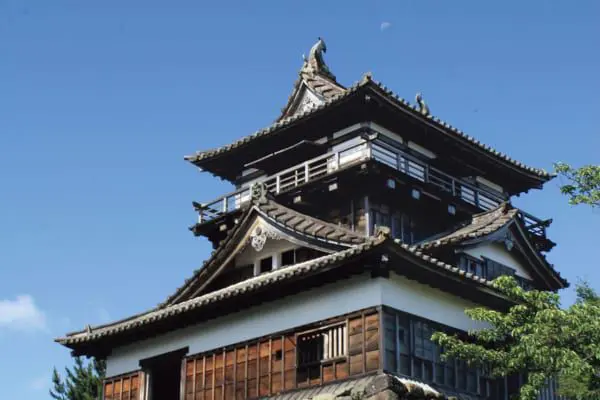

# 彦根城（滋賀県彦根市）
月明かりに浮かぶ、美しき国宝５天守のひとつ

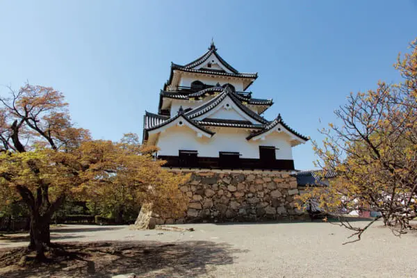

# 姫路城（兵庫県姫路市）
平成の保存修理を経て、生まれ変わった美しい白鷺の城

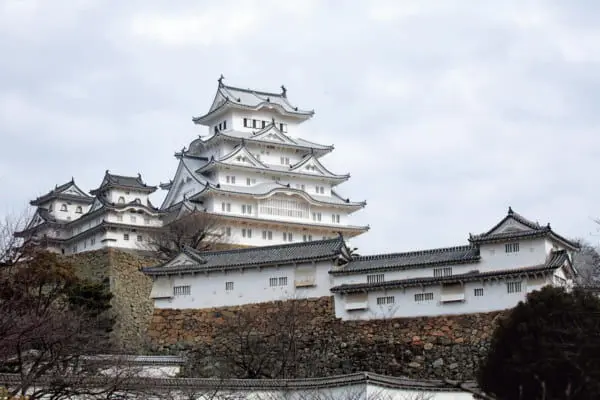

# 備中松山城（岡山県高梁市）
備中国を統治する難攻不落の“天空の城”

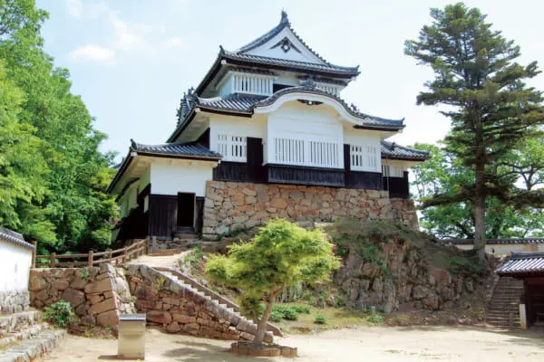

# 松江城（島根県松江市）
江戸時代の城ながら、安土桃山の伝統を継ぐ実戦向け天守

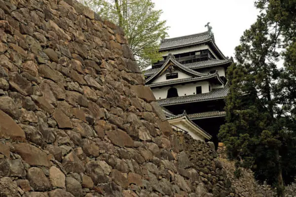

# 丸亀城（香川県丸亀市）
築城の名手が築いた日本一の高石垣の名城

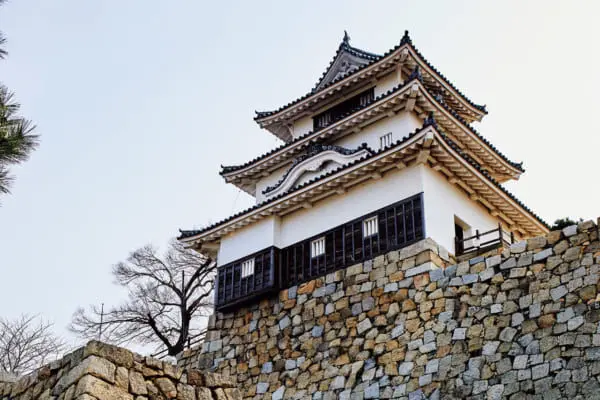

# 高知城（高知県高知市）
日本で唯一本丸建築群が全て現存する南海道の名城

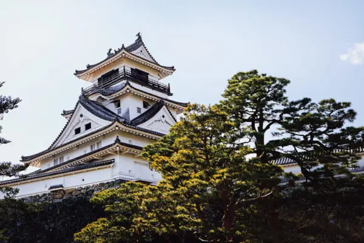

# 松山城（愛媛県松山市）
21棟の重要文化財を擁す難攻不落の名城

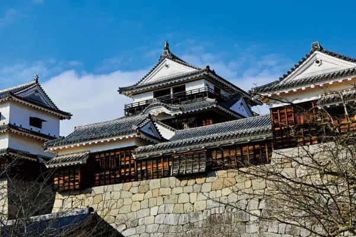

# 宇和島城（愛媛県宇和島市）
藤堂高虎の傑作を伊達氏が仕上げた端正な海城

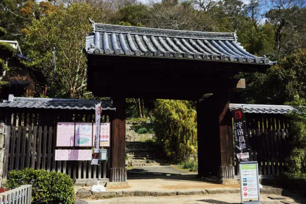

[Index](../index.md)