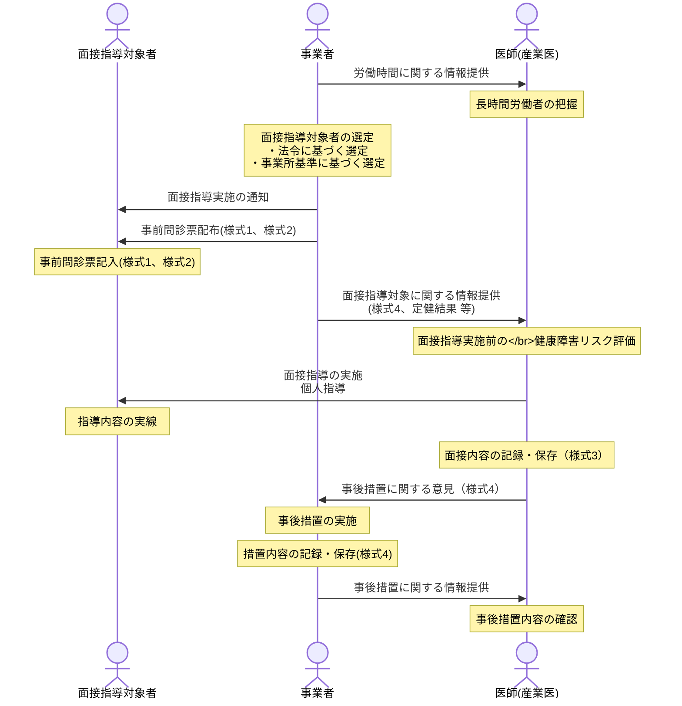

test

test

test

```mermaid
graph TD;
    A-->B;
    A-->C;
    B-->D;
    C-->D;
```

```mermaid
sequenceDiagram
    actor pt as 面接指導対象者
    actor co as 事業者
    actor dr as 医師(産業医)
    
    #
    co->>dr: 労働時間に関する情報提供
    NOTE over dr: 長時間労働者の把握
    NOTE over co: 面接指導対象者の選定<br/>・法令に基づく選定<br/>・事業所基準に基づく選定
    co->>pt: 面接指導実施の通知
    co->>pt: 事前問診票配布(様式1、様式2)
    NOTE over pt: 事前問診票記入(様式1、様式2)
    co->>dr: 面接指導対象に関する情報提供<br/>(様式4、定健結果 等)
    NOTE over dr: 面接指導実施前の</br>健康障害リスク評価
    dr->>pt: 面接指導の実施<br/>個人指導
    NOTE over pt: 指導内容の実線
    NOTE over dr: 面接内容の記録・保存（様式3）
    dr->>co: 事後措置に関する意見（様式4）
    NOTE over co: 事後措置の実施
    NOTE over co: 措置内容の記録・保存(様式4)
    co->>dr: 事後措置に関する情報提供
    NOTE over dr: 事後措置内容の確認
```

[参考元](https://note.com/ohpforsme/n/n9a445b4e9efb)