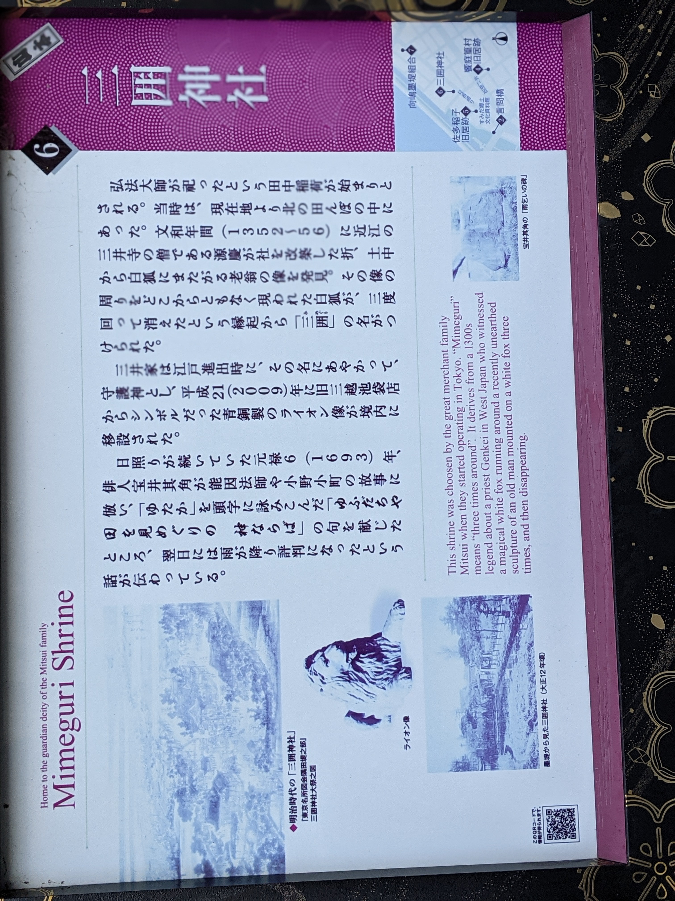

# Title

[2021-03-19](2021-03-19)

[2021-10-08](2021-10-08)

[2020-10-31_高知](./2020-10-31_高知)

[2020-09-19_奈良](./2020-09-19_奈良)

[2020-09-03_上野美術館](./2020-09-03)

[2021-03-20](./2021-03-20)

aaa

bbb
ccc

(./test.jpg)

ERP（統合基幹業務システム）グローバル展開のための9つの必須要件

温室効果ガス排出削減のためのカーボンプライシング等の政策手法に関する調査
